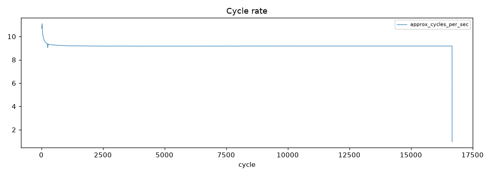
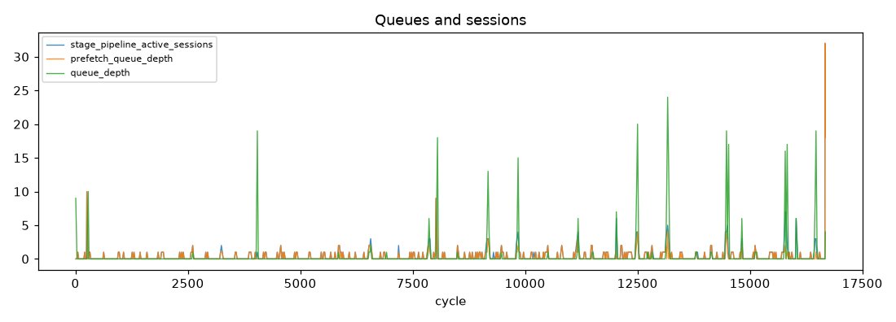
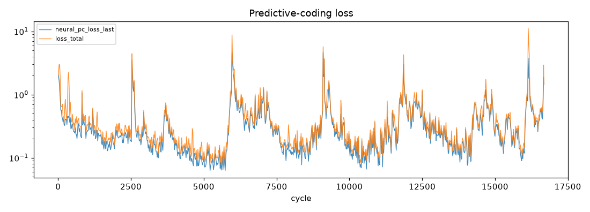
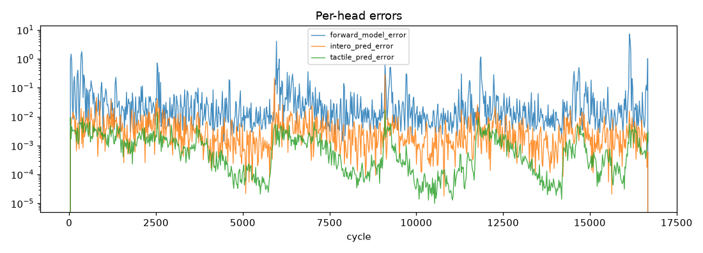
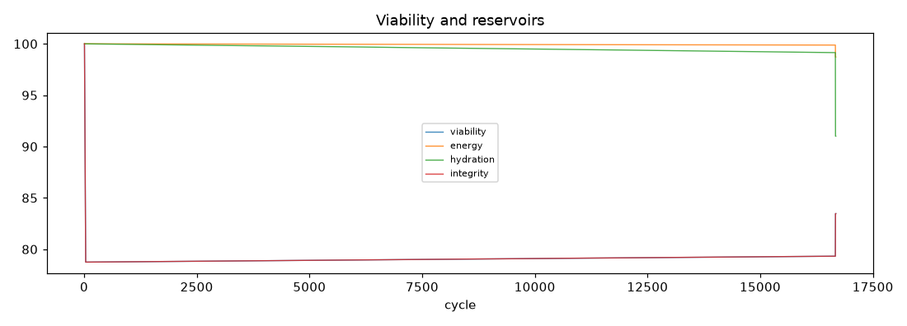
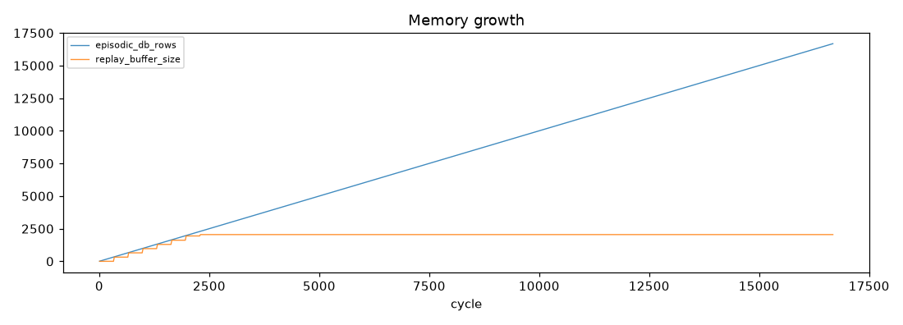

# Run Report - soak_20260703_135533

**Result:** completed · **Git:** `90fd139` · **Duration target:** 1.0 h · **Samples:** 860 · **Stalls:** 0

## Verdict

**Overall: FAIL**

- [PASS] no stalls - stall_events=0
- [FAIL] cycle rate holds - first-hour=3.98Hz worst-later=0.00Hz floor=1.99Hz
- [PASS] no NaN recoveries - nan_recovery_events=0
- [FAIL] pc loss decreases - half-means 0.3217 -> 0.3753
- [PASS] growth events observed (informational) - growth_events=1

> Standing caveat: the dominant-loss canary misfires on synthetic proprioception-only input (PC loss legitimately dominates). Re-evaluate under MuJoCo embodied input.

## 1. Stability

- cycles: 9 -> 16677
- cycle rate (per-minute): mean 8.87 Hz, min 0.00, max 9.42
- frames received/dropped: 18 / 17
- nan recoveries: 0
- gpu mem (MiB) first -> last: 4267 -> 2884
- run dir size: 16.3 MB · disk free: 1523.7 GB

## 2. Learning

- `neural_pc_loss_last`: 2.0226 -> 1.4352 (half-means 0.3217 -> 0.3753, up)
- `loss_total`: 2.0262 -> 1.4571 (half-means 0.4176 -> 0.4684, up)
- `forward_model_error`: 0.0000 -> 0.0000 (half-means 0.0701 -> 0.0727, up)
- `intero_pred_error`: 0.0000 -> 0.0000 (half-means 0.0054 -> 0.0037, down)
- `tactile_pred_error`: 0.0000 -> 0.0030 (half-means 0.0016 -> 0.0008, down)
- `effort_pred_error`: 0.0000 -> 0.0022 (half-means 0.0012 -> 0.0006, down)
- `consolidator_loss`: 0.0000 -> 1.3117 (half-means 2.6629 -> 1.1327, down)
- rewire events: 66 · growth events: 1
- plasticity freezes/thaws: 0/0

## 3. State coherence (A-F)

- `a_norm`: insufficient samples
- `b_norm`: insufficient samples
- `c_norm`: insufficient samples
- `e_norm`: insufficient samples
- viability first -> last: 100.00 -> 83.47
- priority distribution: explore: 52.0%, investigate: 41.4%, avoid: 6.6%

*(plot unavailable - matplotlib not installed or too few samples)*

*(plot unavailable - matplotlib not installed or too few samples)*

## 4. Memory and consolidation

- episodic rows: 9 -> 16677 (13.5 MB)
- LTM db: 0.0 MB · property beliefs: 0
- replay buffer: 2048 · replays: 200
- recall cache hits/misses: 20846/0

## 5. Distinctness

*Single-run report - populated in comparison mode (`--compare run_a run_b`) once the baseline agent exists.*
