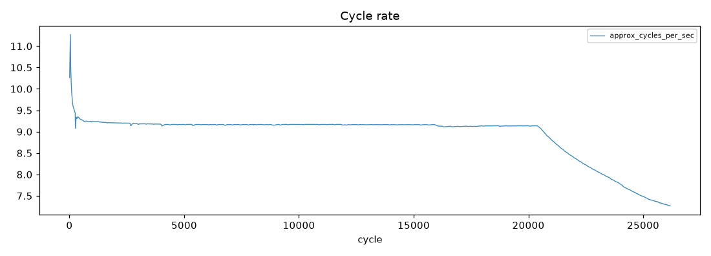
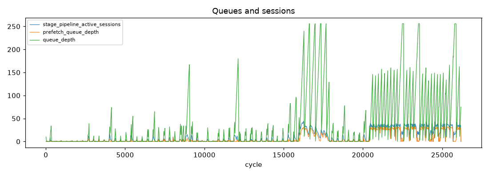
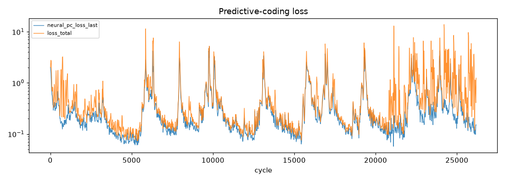
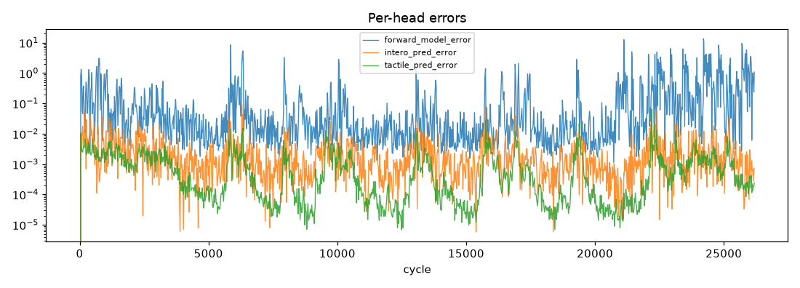
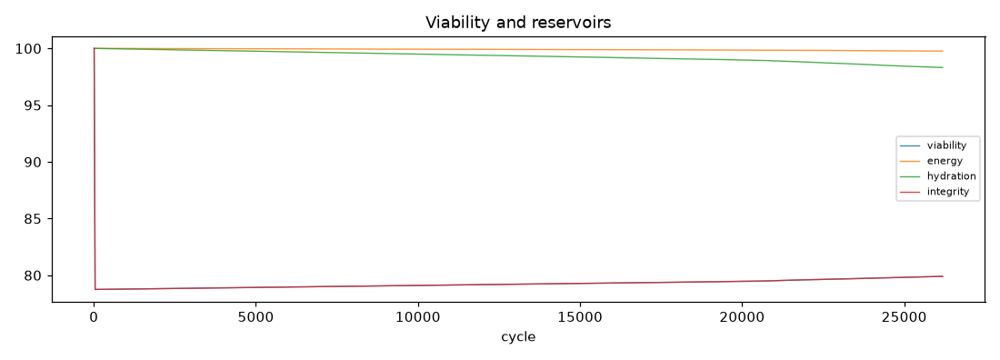
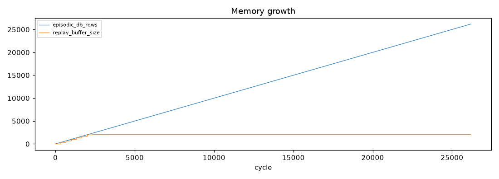

# Run Report - soak_20260703_184026

**Result:** completed · **Git:** `90fd139` · **Duration target:** 1.0 h · **Samples:** 1303 · **Stalls:** 0

## Verdict

**Overall: FAIL**

- [PASS] no stalls - stall_events=0
- [SKIP] cycle rate holds - run shorter than 2 rollup hours - not evaluated
- [PASS] no NaN recoveries - nan_recovery_events=0
- [FAIL] pc loss decreases - half-means 0.3245 -> 0.3853
- [PASS] growth events observed (informational) - growth_events=4

> Standing caveat: the dominant-loss canary misfires on synthetic proprioception-only input (PC loss legitimately dominates). Re-evaluate under MuJoCo embodied input.

## 1. Stability

- cycles: 10 -> 26182
- cycle rate (per-minute): mean 7.21 Hz, min 3.07, max 9.48
- frames received/dropped: 0 / 693
- nan recoveries: 0
- gpu mem (MiB) first -> last: 2378 -> 4011
- run dir size: 25.1 MB · disk free: 1522.0 GB

## 2. Learning

- `neural_pc_loss_last`: 2.0134 -> 0.1509 (half-means 0.3245 -> 0.3853, up)
- `loss_total`: 2.0173 -> 1.2452 (half-means 0.4918 -> 0.8901, up)
- `forward_model_error`: 0.0000 -> 1.0814 (half-means 0.1456 -> 0.4831, up)
- `intero_pred_error`: 0.0000 -> 0.0007 (half-means 0.0036 -> 0.0028, down)
- `tactile_pred_error`: 0.0000 -> 0.0002 (half-means 0.0012 -> 0.0011, down)
- `effort_pred_error`: 0.0000 -> 0.0000 (half-means 0.0009 -> 0.0005, down)
- `consolidator_loss`: 0.0000 -> 1.2933 (half-means 2.2459 -> 1.1461, down)
- rewire events: 102 · growth events: 4
- plasticity freezes/thaws: 5/5

## 3. State coherence (A-F)

- `a_norm`: insufficient samples
- `b_norm`: insufficient samples
- `c_norm`: insufficient samples
- `e_norm`: insufficient samples
- viability first -> last: 100.00 -> 79.90
- priority distribution: explore: 49.7%, investigate: 41.6%, avoid: 8.7%

*(plot unavailable - matplotlib not installed or too few samples)*

*(plot unavailable - matplotlib not installed or too few samples)*

## 4. Memory and consolidation

- episodic rows: 10 -> 26182 (21.4 MB)
- LTM db: 0.0 MB · property beliefs: 0
- replay buffer: 2048 · replays: 356
- recall cache hits/misses: 32727/0

## 5. Distinctness

*Single-run report - populated in comparison mode (`--compare run_a run_b`) once the baseline agent exists.*
