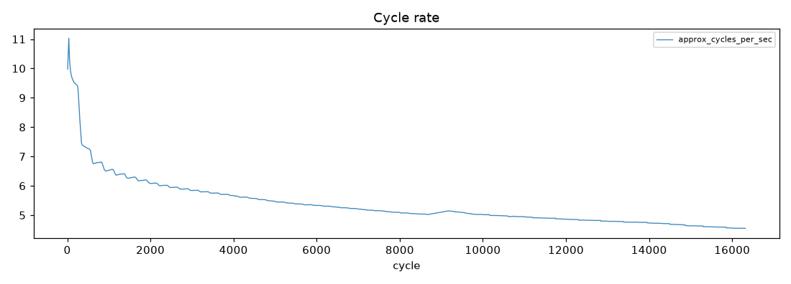
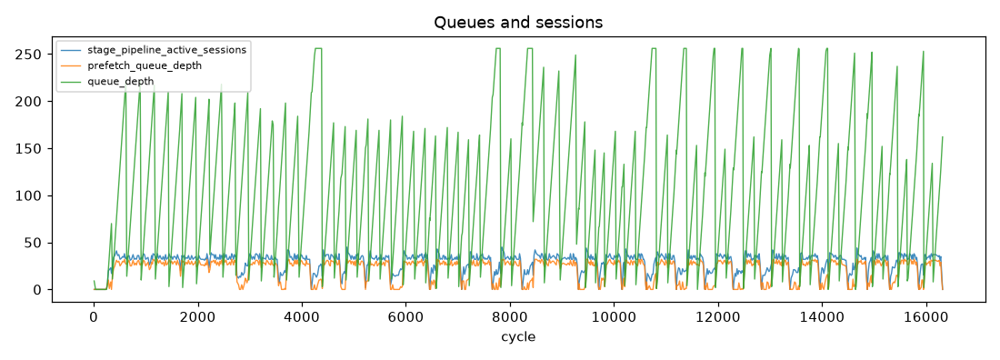
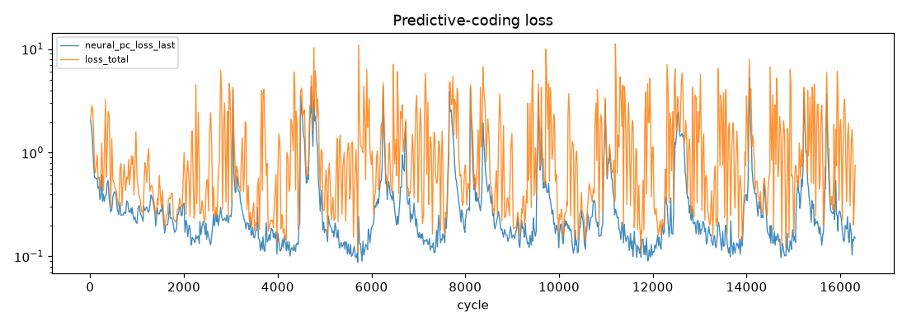
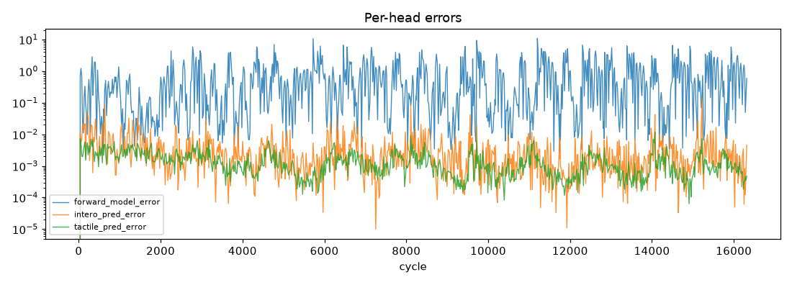
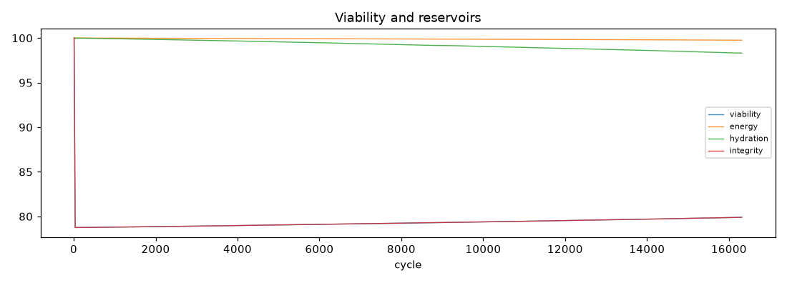
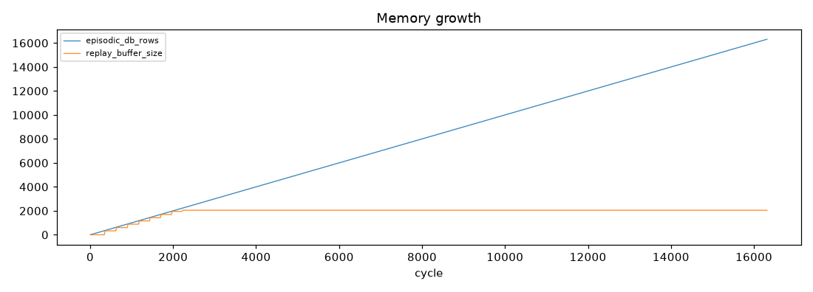

# Run Report - soak_20260703_195521

**Result:** completed · **Git:** `90fd139` · **Duration target:** 1.0 h · **Samples:** 975 · **Stalls:** 0

## Verdict

**Overall: PASS**

- [PASS] no stalls - stall_events=0
- [SKIP] cycle rate holds - run shorter than 2 rollup hours - not evaluated
- [PASS] no NaN recoveries - nan_recovery_events=0
- [PASS] pc loss decreases - half-means 0.4138 -> 0.3472
- [PASS] growth events observed (informational) - growth_events=2

> Standing caveat: the dominant-loss canary misfires on synthetic proprioception-only input (PC loss legitimately dominates). Re-evaluate under MuJoCo embodied input.

## 1. Stability

- cycles: 9 -> 16315
- cycle rate (per-minute): mean 4.46 Hz, min 0.82, max 7.45
- frames received/dropped: 0 / 1775
- nan recoveries: 0
- gpu mem (MiB) first -> last: 3077 -> 4415
- run dir size: 16.7 MB · disk free: 1520.9 GB

## 2. Learning

- `neural_pc_loss_last`: 2.0375 -> 0.1509 (half-means 0.4138 -> 0.3472, down)
- `loss_total`: 2.0411 -> 0.7601 (half-means 1.1641 -> 1.3125, up)
- `forward_model_error`: 0.0000 -> 0.5893 (half-means 0.7218 -> 0.9448, up)
- `intero_pred_error`: 0.0000 -> 0.0045 (half-means 0.0049 -> 0.0031, down)
- `tactile_pred_error`: 0.0000 -> 0.0005 (half-means 0.0018 -> 0.0011, down)
- `effort_pred_error`: 0.0000 -> 0.0000 (half-means 0.0013 -> 0.0005, down)
- `consolidator_loss`: 0.0000 -> 1.9685 (half-means 2.6424 -> 1.7910, down)
- rewire events: 63 · growth events: 2
- plasticity freezes/thaws: 4/4

## 3. State coherence (A-F)

- `a_norm`: insufficient samples
- `b_norm`: insufficient samples
- `c_norm`: insufficient samples
- `e_norm`: insufficient samples
- viability first -> last: 100.00 -> 79.90
- priority distribution: explore: 53.5%, investigate: 40.5%, avoid: 5.9%

*(plot unavailable - matplotlib not installed or too few samples)*

*(plot unavailable - matplotlib not installed or too few samples)*

## 4. Memory and consolidation

- episodic rows: 9 -> 16314 (22.2 MB)
- LTM db: 0.0 MB · property beliefs: 0
- replay buffer: 2048 · replays: 312
- recall cache hits/misses: 20392/1

## 5. Distinctness

*Single-run report - populated in comparison mode (`--compare run_a run_b`) once the baseline agent exists.*
