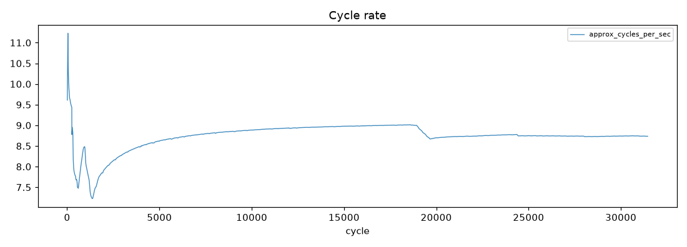
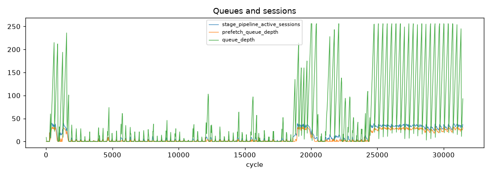
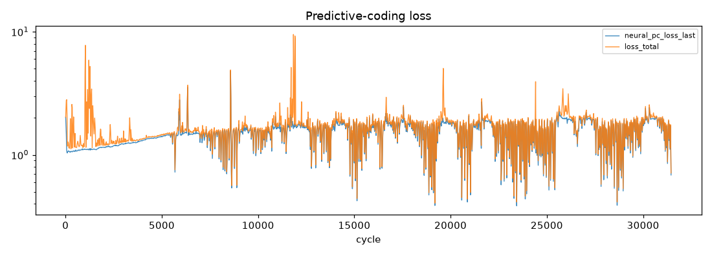
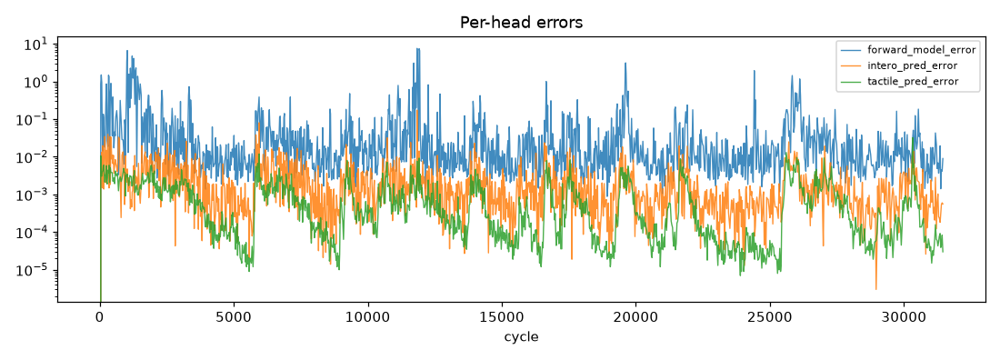
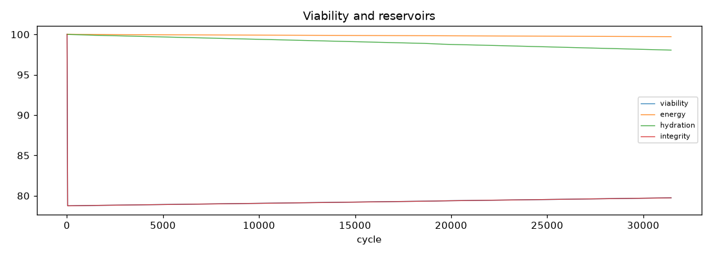
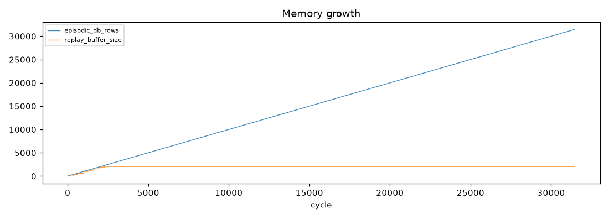

# Run Report - soak_20260704_110108

**Result:** completed · **Git:** `d827369` · **Duration target:** 1.0 h · **Samples:** 1411 · **Stalls:** 0

## Verdict

**Overall: FAIL**

- [PASS] no stalls - stall_events=0
- [SKIP] cycle rate holds - run shorter than 2 rollup hours - not evaluated
- [PASS] no NaN recoveries - nan_recovery_events=0
- [FAIL] pc loss decreases - half-means 1.4253 -> 1.5815
- [PASS] growth events observed (informational) - growth_events=8

> Standing caveat: the dominant-loss canary misfires on synthetic proprioception-only input (PC loss legitimately dominates). Re-evaluate under MuJoCo embodied input.

## 1. Stability

- cycles: 9 -> 31451
- cycle rate (per-minute): mean 8.64 Hz, min 2.62, max 9.48
- frames received/dropped: 32352 / 542
- nan recoveries: 0
- gpu mem (MiB) first -> last: 3814 -> 4830
- run dir size: 38.6 MB · disk free: 1519.2 GB

## 2. Learning

- `neural_pc_loss_last`: 2.0204 -> 0.6859 (half-means 1.4253 -> 1.5815, up)
- `loss_total`: 2.0239 -> 0.7127 (half-means 1.6201 -> 1.6653, up)
- `forward_model_error`: 0.0000 -> 0.0090 (half-means 0.1558 -> 0.0489, down)
- `intero_pred_error`: 0.0000 -> 0.0006 (half-means 0.0041 -> 0.0019, down)
- `tactile_pred_error`: 0.0000 -> 0.0000 (half-means 0.0012 -> 0.0008, down)
- `effort_pred_error`: 0.0000 -> 0.0000 (half-means 0.0009 -> 0.0005, down)
- `consolidator_loss`: 0.0000 -> 0.7328 (half-means 2.4032 -> 1.2920, down)
- rewire events: 125 · growth events: 8
- plasticity freezes/thaws: 0/0

## 3. State coherence (A-F)

- `a_norm`: insufficient samples
- `b_norm`: insufficient samples
- `c_norm`: insufficient samples
- `e_norm`: insufficient samples
- viability first -> last: 100.00 -> 79.74
- priority distribution: explore: 52.5%, investigate: 47.5%

*(plot unavailable - matplotlib not installed or too few samples)*

*(plot unavailable - matplotlib not installed or too few samples)*

## 4. Memory and consolidation

- episodic rows: 9 -> 31451 (25.7 MB)
- LTM db: 0.0 MB · property beliefs: 0
- replay buffer: 2048 · replays: 380
- recall cache hits/misses: 70764/0

## 5. Distinctness

*Single-run report - populated in comparison mode (`--compare run_a run_b`) once the baseline agent exists.*
